# 🌙 Mood Tracker App

Aplikasi Android untuk melacak suasana hati harian, membaca quotes positif, menyimpan jurnal singkat, dan memantau perkembangan emosi melalui mood board.

---

## 📌 Fitur Utama

### 🗒️ 1. Diary / Dashboard

* Ringkasan suasana hati harian
* Kalender
* Responsif untuk portrait & landscape

### 💬 2. Quotes

* Quotes motivasi harian
* Bisa dicopy & dibagikan
* Mode portrait & landscape

### ➕ 3. Add Mood

* Pilih mood (happy, sad, angry, neutral, sleep)
* Tambahkan catatan/jurnal
* Tersimpan di database lokal

### 📊 4. Mood Board

* Chart mood jangka panjang
* Mendukung landscape

### ⚙️ 5. Settings

* Bahasa (ID / EN)
* Reminder mood
* Preferensi tampilan

---

## 🖼️ Screenshot Aplikasi

---

## 📍 Dashboard

|                                                         |                                                                              |
| ------------------------------------------------------- | ---------------------------------------------------------------------------- |
| 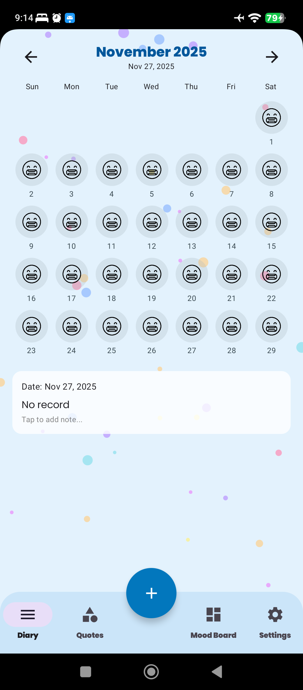 | 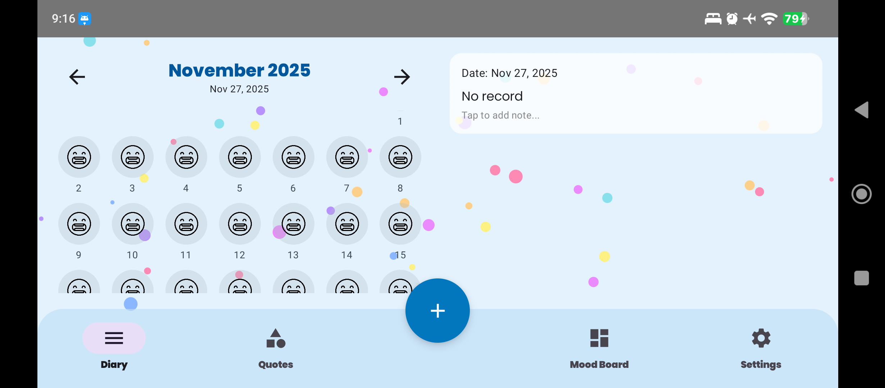 |

---

## 💬 Quotes

|                                                                  |                                                                        |                                                                |
| ---------------------------------------------------------------- | ---------------------------------------------------------------------- | -------------------------------------------------------------- |
| 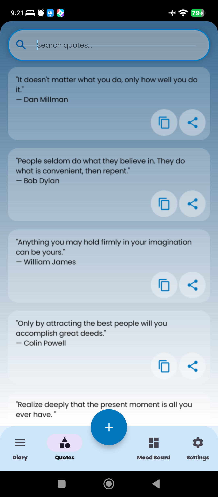     | 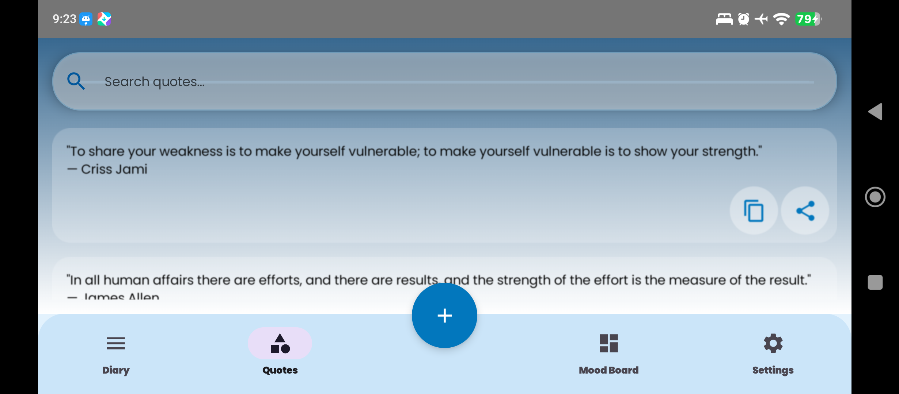 | 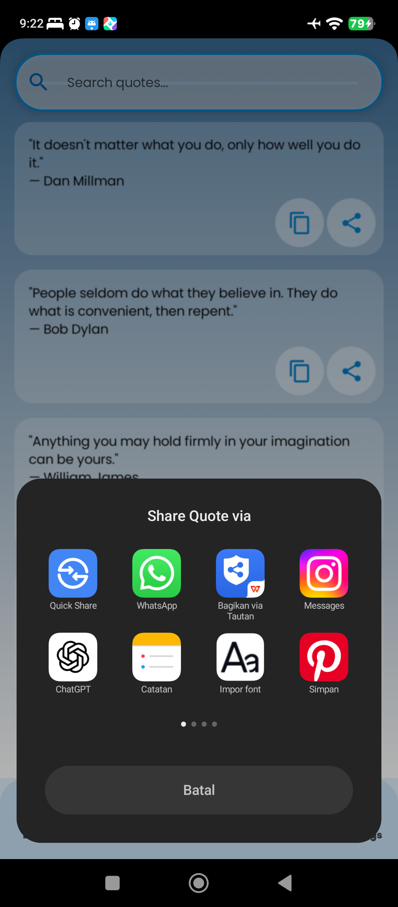 |
| 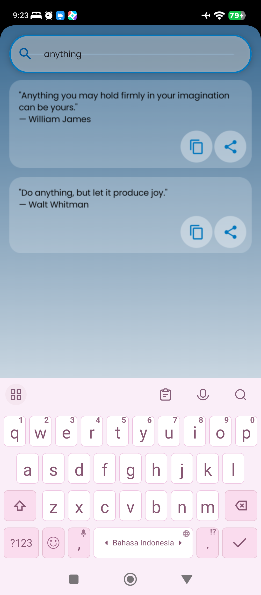 | 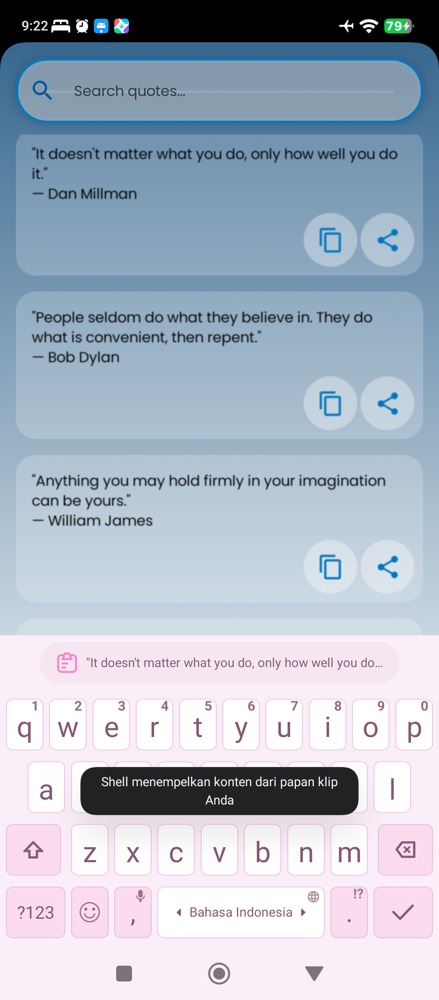 |                                                                |

--- 

## ➕ Add Mood

|                                                        |
| ------------------------------------------------------ |
| 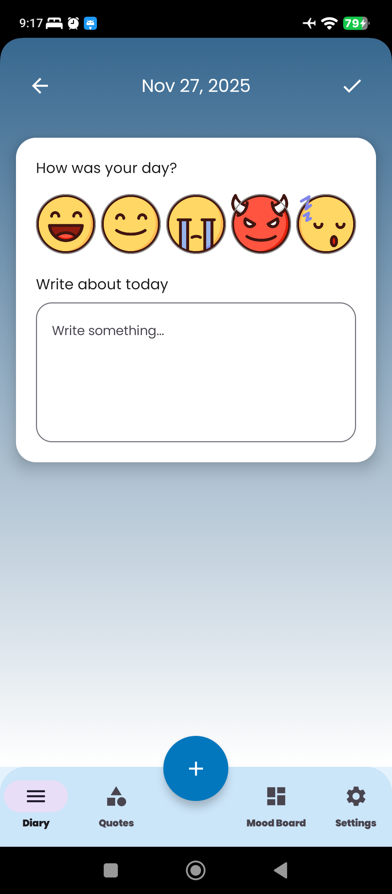 |

---

## 📊 Mood Board

|                                                            |                                                                              |
| ---------------------------------------------------------- | ---------------------------------------------------------------------------- |
| 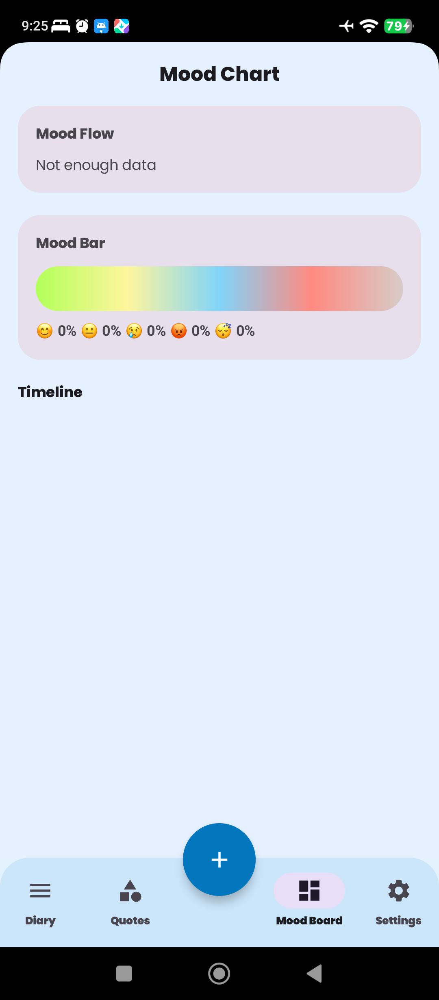 | 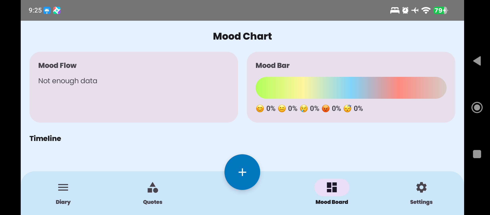 |

---

## 😊 Kalender Berdasarkan Mood

|                                                                  |                                                                |                                                            |
| ---------------------------------------------------------------- | -------------------------------------------------------------- | ---------------------------------------------------------- |
| 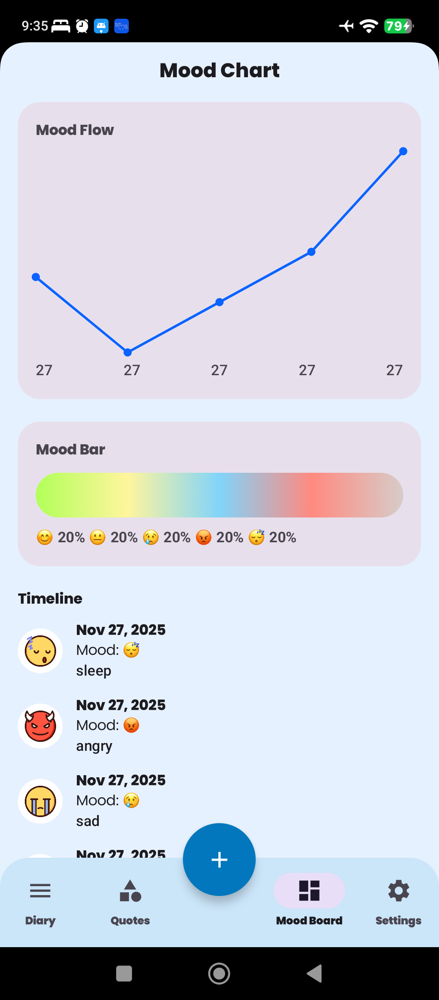 |      | 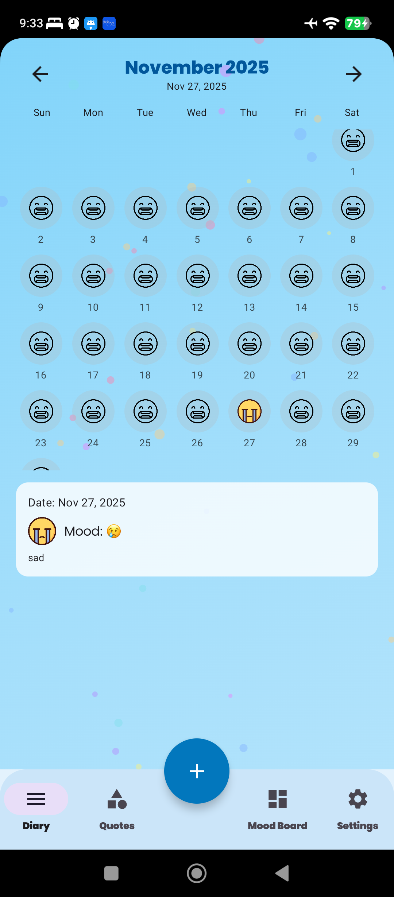     |
| 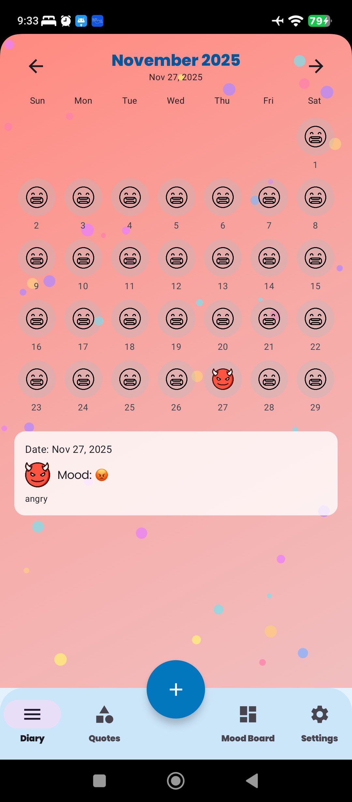       | 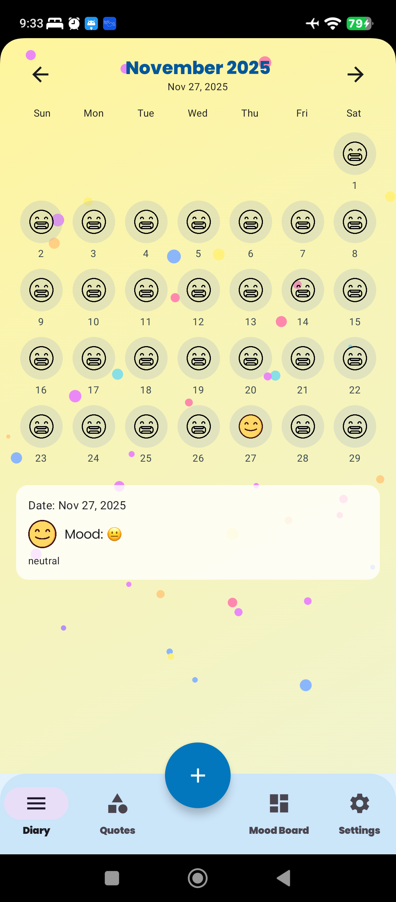 | 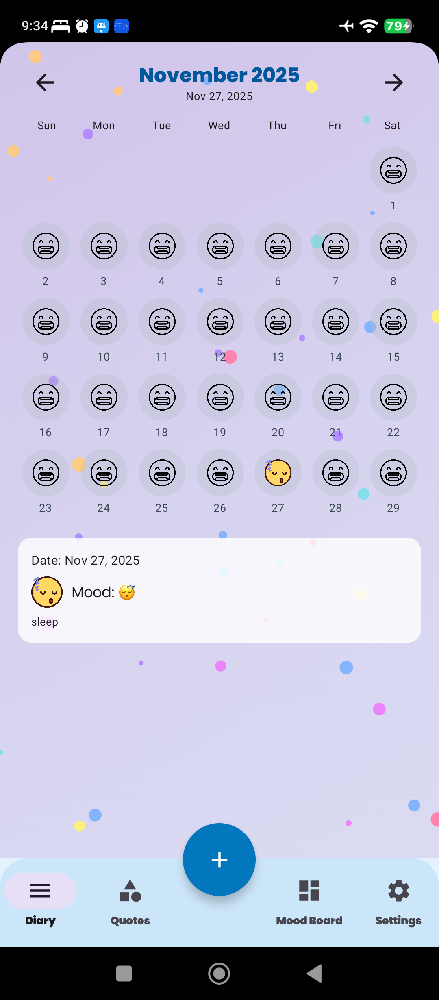 |

---

## ⚙️ Settings

|                                                                  |                                                                            |                                                       |
| ---------------------------------------------------------------- | -------------------------------------------------------------------------- | ----------------------------------------------------- |
| 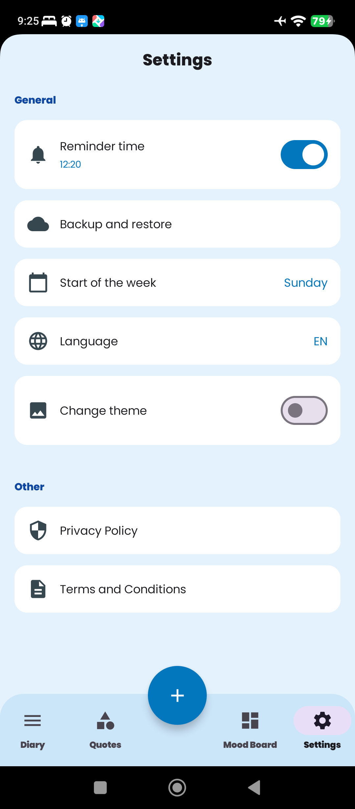            | 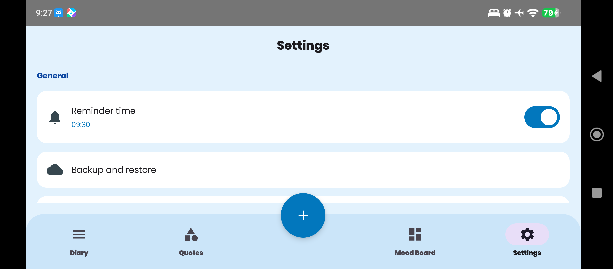 | 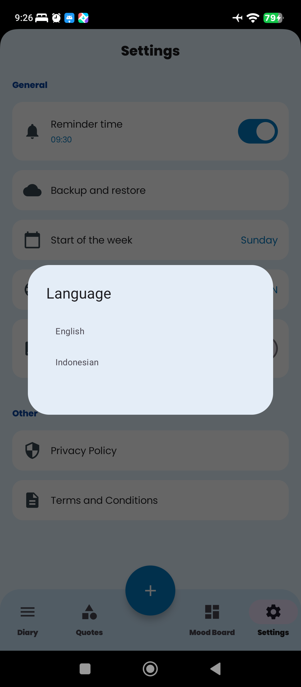 |
| 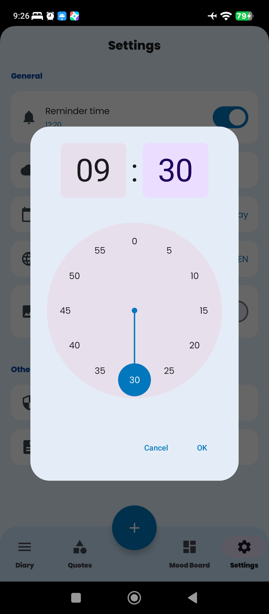 | 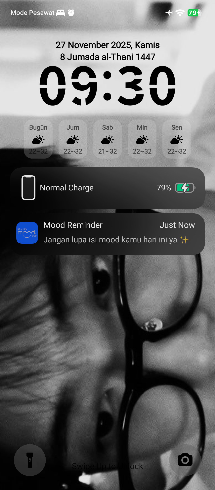       |                                                       |

---

## 🌐 Dashboard Berdasarkan Bahasa

|                                                                |                                                          |
| -------------------------------------------------------------- | -------------------------------------------------------- |
|  | 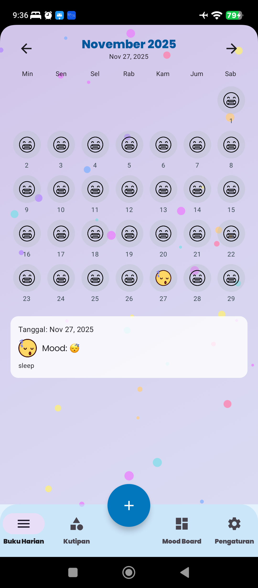 |

---

## 🧭 Navigation Flow (Bottom Navigation)

```
[ Diary ]      → Dashboard utama
[ Quotes ]     → Kumpulan motivasi
[ Add Mood ]   → Input suasana hati
[ Mood Board ] → Riwayat & grafik mood
[ Settings ]   → Bahasa, reminder, preferensi
```

Menggunakan **Jetpack Navigation Compose**, setiap tab memakai `Composable` screen masing-masing.

---

## 🛠️ Teknologi yang Digunakan

* Kotlin
* Jetpack Compose
* Material 3
* Room
* Navigation Compose
* ViewModel + State Management

---

## 🚀 Cara Menjalankan

1. Clone repository:

   ```
   git clone https://github.com/tiarasyahrani/moodtrackerapp.git
   ```

2. Buka di **Android Studio**

3. Sync Gradle

4. Run di emulator / device

---

## 🧑‍💻 Developer

**TIARA SYAHRANI**
